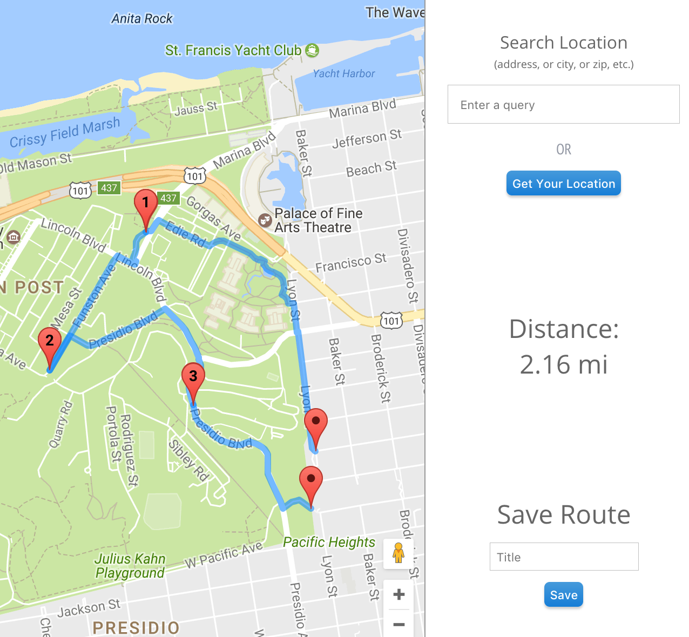

# README

* Description of App and features
* Screenshot of sample route
* Screenshot of API tests in Postman

# MapMyJog


[Link to live site](https://map-my-jog.herokuapp.com)


MapMyJog is full-stack web application clone of MapMyRun, using Ruby on Rails with a PostgreSQL database on the backend and React.js/Redux on the frontend. Users are able to map out the paths they have walked/run and keep track of the total distance of the planned routes.

## Features and implementation

### Path creation

The core feature of this application is the utilization of Google Maps API to mark and render the routes.



This map utilizes 3 APIs, the core Google Maps JavaScript API, the Directions Service API, and the Google Places Web Service API. Users can add markers to the map by clicking on it, and on each click, the app will get walking directions for the current route.

Some notable customizations this app uses for a smooth user experience are,
1) Autozoom turned off
2) Markers snap to nearest walkable path
3) Search by location or get current location
4) Custom markers and labels on map
5) Cumulative distance-display for all route legs

```javascript
initializeMap(initialPosition, zoom) {
  const mapOptions = {
    center: initialPosition,
    zoom
  };
  this.map = new google.maps.Map(document.getElementById('map'), mapOptions);
  this.route = new Route(this.map, this.setState.bind(this));

  this.addClickListener();
}

addClickListener() {
  this.map.addListener('click', e => {
    const lat = e.latLng.lat();
    const lng = e.latLng.lng();
    const waypoints = this.state.waypoints;
    this.setState({ waypoints: [...waypoints, { location: { lat, lng } }]});

    this.directions = this.route.getDirections(this.state.waypoints);
    if (this.directions) { this.directions.setMap(null); }
  });
}
```


### TODO: JSON Stringify


### TODO: Error Handling or Guest Login


## Future Directions for the Project

#### Saving Routes/My Routes Page

The next update will allow users to save routes and view them on a user profile page. This will display a thumbnail of the route and the title. Clicking on a route will show a route detail page with a blown up version of the route in addition to some other information.

#### Going on Runs

Besides mapping and saving routes, I want users to be able to record runs as well.  Users would record the specific route they ran and the time it took them to complete the route.

#### Dashboard/Statistics

A great feature to have on the user profile page would be a dashboard that keeps track of a user's running statistics.  I think that the dashboard on MapMyRun and other running sites can be greatly improved.
